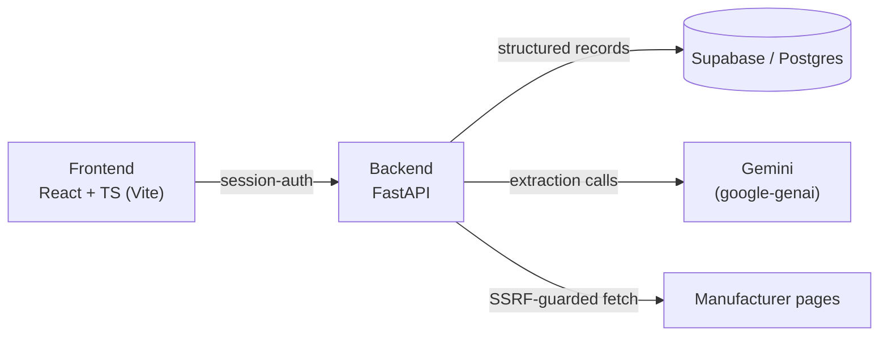

# Nuvilog

Turns Unilog's raw catalog rows into structured, evidence-backed dishwasher product records and refuses to guess what it can't verify.

## What it does

Nuvilog ingests Unilog's raw 1000-row product catalog and produces a structured, enriched dishwasher product record per row: UOM/fraction normalization, a manufacturer/brand honesty layer, a 15-label attribute scaffold, manufacturer-page enrichment, and a generated commerce description. Every stage is scored against a real evaluation harnessnot eyeballed. Two rows with verified manufacturer ground truth are scored for accuracy; every other row is scored on structural and honesty checks only, because there's nothing to compare it against.

## Why it's different

- Confidence is scored from real evidence (source-text matches, verified manufacturer-page fetches) never an LLM rating its own output
- Every gap is explicitly flagged as unresolved, never silently guessed or defaulted
- Self-tested against real ground truth at every pipeline stage, not just internal consistency checks

## Real numbers

Pulled directly from `backend/reports/*.json` — regenerate with the commands in [Getting started](#getting-started).

**Evaluation, 10 dishwasher rows** ([`step6_7_report.json`](backend/reports/step6_7_report.json)):

| | |
|---|---|
| Tier 1 — exact match vs. ground truth, `PDSH4816AF` | 210/252 fields |
| Tier 1 — exact match vs. ground truth, `WDTS7024RZ` | 202/252 fields |
| Tier 2 — rule compliance (10 rows) | 110/110 (100%) |
| Tier 3 — honesty checks (10 rows) | 1768/1768 (100%) |
| Tier-3 honesty violations | **0** |

**Manufacturer + UOM scale run, 1000 rows** ([`step9_scale_report.json`](backend/reports/step9_scale_report.json)):

| | |
|---|---|
| Rows processed | 1000 |
| Fabricated MANUFACTURER_NAME/BRAND_NAME values | **0** |
| Vendor code present / no vendor data | 959 / 41 |
| Distinct canonical manufacturer names | 76 |
| UOM/fraction pattern found | 611 rows (61.1%) |
| Of those, parsed cleanly | 434 rows (71.0%) |
| Of those, correctly reported unparsed | 177 rows (29.0%) |

## Scope

The pipeline is proven end-to-end on 10 real dishwasher rows, 2 of which (`PDSH4816AF`, `WDTS7024RZ`) have verified manufacturer ground truth to score against; the other 8 are scored structurally only, since there's nothing to compare them to. The remaining appliance sub-types found in the same dataset range, washer, microwave, freezer, cooktop (31 more real rows total) are explicitly marked `NOT_BUILT` in [`pipeline/inferred_rules.py`](backend/pipeline/inferred_rules.py) rather than run through the dishwasher scaffold: the 15-label attribute structure was derived from and validated against dishwasher rows only, and applying it to a different appliance category without evidence would be exactly the kind of fabrication this project refuses to do.

## Pipeline

1. **Data prep** ([`step1_data_prep.py`](backend/scripts/step1_data_prep.py)) — load and clean the raw 1000-row CSV
2. **Schema** ([`delivery_format.py`](backend/pipeline/delivery_format.py)) — the 252-column delivery format target
3. **UOM/fraction normalize** ([`uom_normalizer.py`](backend/pipeline/uom_normalizer.py), [`fraction_converter.py`](backend/pipeline/fraction_converter.py)) — units and fractional dimensions to a consistent format
4. **Manufacturer/brand honesty layer** ([`step4_manufacturer.py`](backend/scripts/step4_manufacturer.py)) — vendor clustering and code parsing, no fabrication
5. **Dishwasher scaffold** ([`step5_dishwasher_schema.py`](backend/scripts/step5_dishwasher_schema.py)) — 15-label attribute structure, blank unless evidenced
6. **Description builder** ([`step6_description_builder.py`](backend/scripts/step6_description_builder.py)) — generates commerce descriptions from verified fields only
7. **Manufacturer enrichment** ([`step8_manufacturer_enrichment.py`](backend/scripts/step8_manufacturer_enrichment.py)) — real fetch of manufacturer pages, measured attribute lift
8. **Evaluation harness** ([`step2_evaluate.py`](backend/scripts/step2_evaluate.py)) — self-tests, then scores real output against ground truth

## Architecture

React + TypeScript (Vite) frontend, FastAPI backend, Supabase (Postgres) for persistence, Gemini (`google-genai`) as the LLM provider.



## Getting started

**Prerequisites:** Python 3.11+, Node, a free [Gemini API key](https://aistudio.google.com/app/apikey), a free [Supabase](https://supabase.com) project.

```bash
git clone https://github.com/ansshhuu/Nuvilog.git
cd Nuvilog/backend
python -m venv venv
```

```powershell
# Windows PowerShell
./venv/Scripts/pip install -r requirements.txt
Copy-Item ../.env.example ../.env
```

```bash
# macOS/Linux bash
venv/bin/pip install -r requirements.txt
cp ../.env.example ../.env
```

Edit `.env` and set `GEMINI_API_KEY`, `SUPABASE_URL`, `SUPABASE_KEY` (Supabase → Project Settings → API; use the `service_role` key), `ADMIN_EMAIL`, `ADMIN_PASSWORD`, and `SESSION_SECRET` (generate with `python -c "import secrets; print(secrets.token_hex(32))"`). Run `supabase/schema.sql` in the Supabase SQL editor once before starting the API.

**Run backend:**

```powershell
./venv/Scripts/uvicorn main:app --reload   # Windows
```
```bash
venv/bin/uvicorn main:app --reload         # macOS/Linux
```

**Run frontend:**

```bash
cd frontend
npm install
npm run dev
```

**Run the eval report:**

```bash
python backend/scripts/step6_7_full_run.py
```

## Live links

- **Live app:** [nuvilog.vercel.app](https://nuvilog.vercel.app/)
- **Repo:** [github.com/ansshhuu/Nuvilog](https://github.com/ansshhuu/Nuvilog)
- **Demo video:** [Watch here](https://drive.google.com/file/d/1h9ohyNBb9M6lScXGkNh5AnlDoD-tPJvL/view?usp=sharing)

## Security

All non-login API routes are gated behind session-token auth ([`backend/auth.py`](backend/auth.py)), and outbound manufacturer-page fetches are SSRF-guarded  refusing anything but a plain `http(s)` request to a public host ([`pipeline/manufacturer_enrichment.py`](backend/pipeline/manufacturer_enrichment.py)).
